# AranCano · 游戏化蚊子包交互（XR 主路径）

**角色标签：** 产品原型 · 交互设计 · XR 空间交互 · 陪伴型 IP（Annno）

**产品侧交付：** 问题定义 · 主路径取舍 · 指标与验证闭环

> 转移注意力：把皮肤发痒引起的持续抓挠冲动，变成一次可按压的游戏化摄像头交互。

AranCano 是一个微信小程序交互原型。用户对准真实蚊子包后，屏幕生成可按压的视觉替身；持续按压会驱动模型形变、声音、振动和界面反馈，最终以塌陷和封印完成收束。

产品是一套**行为替代交互原型**：用空间贴附、长按和多通道反馈，给「知道不该抓，手还是想动」的那几秒一个可完成的屏幕动作。

本页重点展示游戏化产品思维、空间交互取舍与多通道反馈设计。它不提供诊断、治疗或止痒效果承诺。完整说明见 [产品说明](docs/CASE-STUDY.md)。

> 公开仓不含源码、算法参数、原始访谈与可识别身份材料。故事板里的局部皮肤来自作者本人或已获书面许可的演示，只说明交互，不作医疗用途。

## 怎么读

- **约 30 秒**：定位 + 下方三格 GIF  
- **约 2 分钟**：问题认领 → 取舍 → 数据卡  
- **深挖**：故事板折叠 · [验证计划](docs/VALIDATION.md) · [METRICS.md](docs/METRICS.md) · [展示素材说明](assets/README.md)

---

## 1. 真机短片（先看动起来的证据）

默认入口：**C 立体跟包**；A 退路；B 仅对照。  
GitHub 打开 mp4 文件页常常不能播，所以主预览用 GIF。

| 开屏与引导 · 15s | 主路径 C · 31s | 次选轻量 A · 18s |
|:---:|:---:|:---:|
| 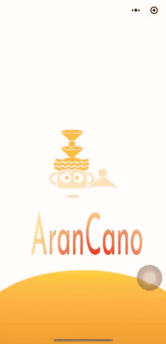 | 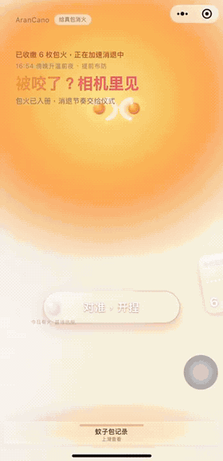 | 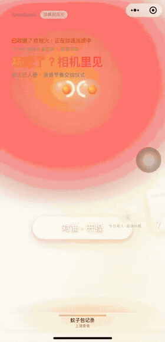 |

- 开屏与引导：开屏 → 说明 → 主页  
- 主路径 C：对准 → 贴住 → 长按 → 收束  
- 轻量 A：兼容退路走法  

有声版：[onboarding](assets/demo/demo-onboarding.mp4) · [track-c](assets/demo/demo-track-c.mp4) · [track-a](assets/demo/demo-track-a.mp4)

主流程：

```
对准 → 出模贴住 → 长按蓄力 → 塌陷封印
```

体验是否成立，主要看三点：像不像贴在包上、按着是否可信、按满有没有结束感。

---

## 2. 要解决什么（问题认领）

蚊子包带来的抓挠冲动又短又反复。抓一下最快，但容易抓破皮引起皮肤破损。药和护理管生理不适；中间还缺一个：**手已经抬起来时，能立刻做完、也有结束感的替代动作。**

### 常见质疑

「咬了抹药或忍一下就好，为什么还要开小程序？」

这个质疑成立。所以产品**不和药物抢治疗**。它只认领另一层：

痒出现后，很多人会抓、会划、会刷手机分心。AranCano 想把「手要动一下」做成对准 → 按住 → 按满 → 收束。抓挠能短暂压住痒感，也可能伤屏障、加重循环（[研究](https://www.nature.com/articles/nn.2292) · [综述](https://pmc.ncbi.nlm.nih.gov/articles/PMC6502296/)）——这解释了为什么「别抓」很难只靠意志。本产品认领的是**行为替代**，不是止痒疗效。

交互能否走完，用本页轻量数据卡观察；**下次痒时还会不会主动打开**，与当场完成率分开，用日记法另轨验证，见 [验证计划](docs/VALIDATION.md)。

### 入口多几步，怎么接

多出来的步骤本身就是摩擦。做法是：**承认摩擦**，把对准、长按做成替代动作的一部分，默认只走一条主路，失败再退路，不让人痒的时候挑三个版本。

| 摩擦 | 现在怎么接 | 验证分层 |
|------|------------|----------|
| 比抓挠慢 | 微信直达；默认立体跟包（C），不行再走轻量平面（A） | 当场：轻量数据卡看完成率 |
| 要对准 | 对准 = 把手从皮肤挪开的第一步 | 引导讲清出模关系；口述已反馈到主路径选择 |
| 下次还会不会开 | 封印、月历、批语做完成记忆；不靠排行榜硬推 | **召回层**已预留；**需求层**日记法另轨验证 |

<details>
<summary><strong>和现有选择比什么</strong>（竞品对照，展开查看）</summary>

| 选择 | 为什么会选 | 强在哪 | 弱在哪 |
|------|------------|--------|--------|
| 抓、掐、搓 | 本能、立刻有感觉 | 最快 | 可能伤皮肤，容易循环 |
| 花露水、药膏等 | 处理生理不适 | 熟悉 | 起效看产品；涂完手仍可能想动 |
| 热敷、止痒器具等 | 用别的刺激盖过痒 | 触感清楚 | 要额外带东西 |
| AranCano | 给手一个可完成的屏幕动作 | 微信直达；形变+声+振；默认一条主路+退路 | 步骤比直接抓多——对准/长按被设计成替代动作本身；「下次还会开」用日记法另轨验，不与当场完成率混谈 |

</details>

---

## 3. 默认 C / 退路 A（取舍）

| 轨道 | 优先保证什么 | 主要代价 | 现在扮演的角色 |
|------|--------------|----------|----------------|
| **A 轻量平面** | 能打开、能按完 | 更像贴片 | 兼容退路 |
| **B 跟手立体** | 跟着红斑走 | 容易和背景「分家」、飘 | 对照，不进默认入口 |
| **C 立体跟包** | 钉在空间里，转手机有视差 | 进场等平面、设备差异 | **当前默认主路径** |

### 为什么先押 C

跟手更紧，不等于看起来更真。B 一迟滞，模型和实景就容易割裂。C 把「全程微漂」换成「进场可能失败一次，但失败说得清、可重试、可退 A」。

真机口述里常有人说 C「更像贴在包上」，也有人更容易注意到进场等待——这与「默认 C、失败退 A」的取舍同向，用轨道实验与退路设计承接，不靠口碑票数定胜负。

钉住之后拆成两件事：

1. **手机在动、包大致不动** → 世界锚稳住模型  
2. **包换位置了** → 用户点「微调贴位」再锁一次；失败就保持原位，不乱跳  

细节见 [产品说明](docs/CASE-STUDY.md)。

### 试用里听到的几句（已脱敏）

- 「拍了蚊子包，画面里冒出个能点的东西，不知道和我的包有什么关系。」→ 出模与真包的关系要在引导里讲清；对准被设计成替代动作的第一步，不是多余步骤。  
- 「放大方向好别扭……应该是俯视的时候。」→ 操作方向要贴合拿机姿势；反馈进交互校准，而不是怪用户。  
- 「只有这个包在动，和背景很割裂。」→ 跟手轨易与实景分家——与默认押 C、B 仅作对照的决策同向。  

这些是定性线索，用来驱动取舍；定量观察见下方轻量数据卡。

**工程边界（简记）：** 空间能力不足时走 A 退路；离页停相机与异步；图像默认本地；性能以统一机型基线对外。

---

## 4. 轻量数据卡（验证闭环）

埋点 → 体验版上报 → 入选口径 → 三指标汇总，形成可复核的观察闭环（非疗效试验）。

| 指标 | 数值 | 口径（预先生效，非事后挑选） |
|------|------|------------------------------|
| 完成率 | 100% | 有本局小结且按满并封印；**n=15**（体验版 trial） |
| 想挠分数前后变化 | ↓45.9 分 | 仅前后探针均认真拖过、未跳过；正数=平均下降；**n=8** |
| 退到轻量 A | 0 次 | `fallbackEntered`；同一批 **n=15** |

**这张卡在证明什么**

- **闭环可跑通**：微信体验版匿名事件进飞书，再按固定规则汇总进作品集，而不是口说「感觉还行」。  
- **口径先于数字**：完成率与想挠变化用两套入选条件；探针未齐只进完成率、不进差值，避免把跳过当成回答。  
- **指标对应设计取舍**：做完一局 / 当场冲动代理量 / XR 失败是否落到 A——分别回看主路径可用性、行为替代手感、退路是否被触发。  

数字是观察结果，**不作止痒或显著性结论**；汇总步骤见 [METRICS.md](docs/METRICS.md)。

---

## 5. 游戏化 + 三通道（短述）

| 作用 | 怎么做 |
|------|--------|
| 有目标 | 真实蚊子包变成可按的火山包子 / 火山果冻；Annno 陪伴，不抢主角 |
| 有进度 | 形变、声音、振动一起跟着按压力度走；松手会回弹 |
| 有终点 | 塌陷 + 封印表示做完；月历可回看，不靠积分留人 |

封印是完成凭证，不是金币。**召回层**（封印图、月历、批语）已落到机制；**需求层**（下次痒还会不会打开）与当场完成率分开，按 [验证计划](docs/VALIDATION.md) 日记法验证。

长按同时走三条线，文案只说明状态，不当第四条玩法：

- **看**：模型被按下、向外铺开  
- **听**：力度感加重，按满有收束音  
- **摸**：振动由轻到密，收束时再加重  

三段节奏：按上 → 蓄力 → 按满收束。进度跟手指，不跟死板的一秒动画。主路径大约数秒按满。

---

## 6. 故事板与外链（细节折叠）

首屏只保留主路径一张；其余收在折叠里，避免一屏刷太长。

[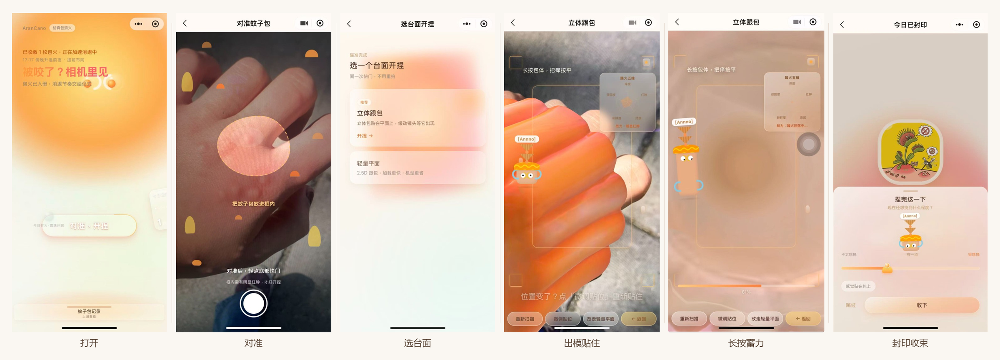](assets/storyboard-main-path.png)

<details>
<summary><strong>引导闭环</strong> · 想挠 → 快门 → 识别 → 长按 → 封印</summary>

[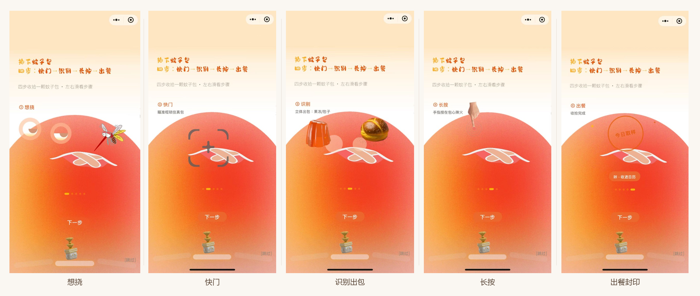](assets/storyboard-guide-loop.png)

</details>

<details>
<summary><strong>按压与多通道</strong> · 开捏前 → 可贴 → 蓄力中</summary>

[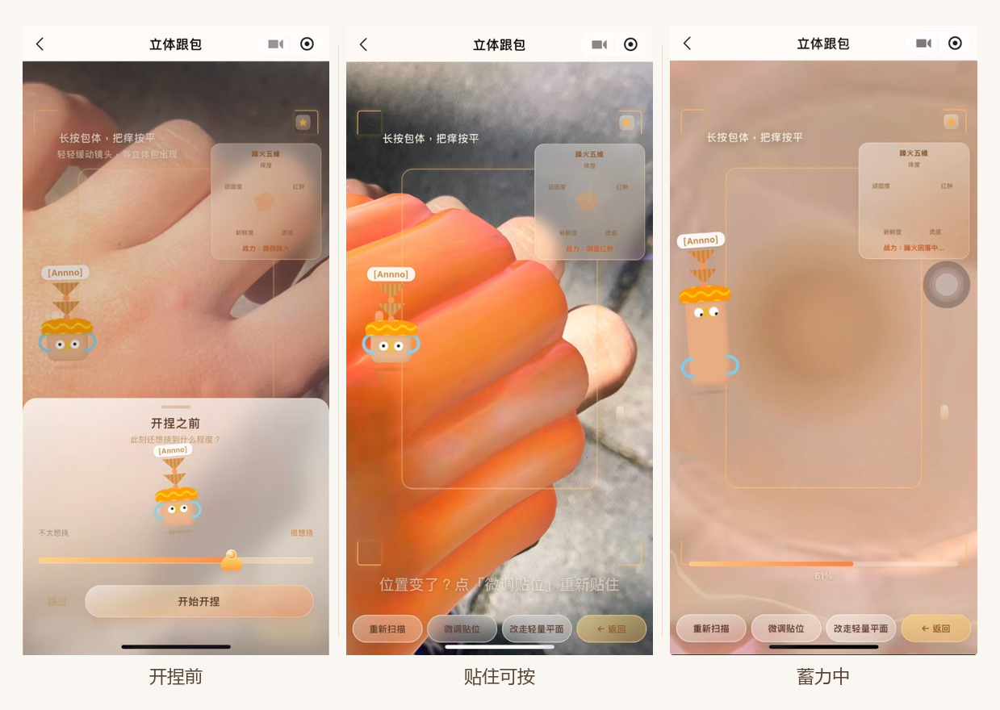](assets/storyboard-press-multimodal.png)

</details>

<details>
<summary><strong>决策与退路</strong> · 默认 C / 退路 A + 微调贴位</summary>

[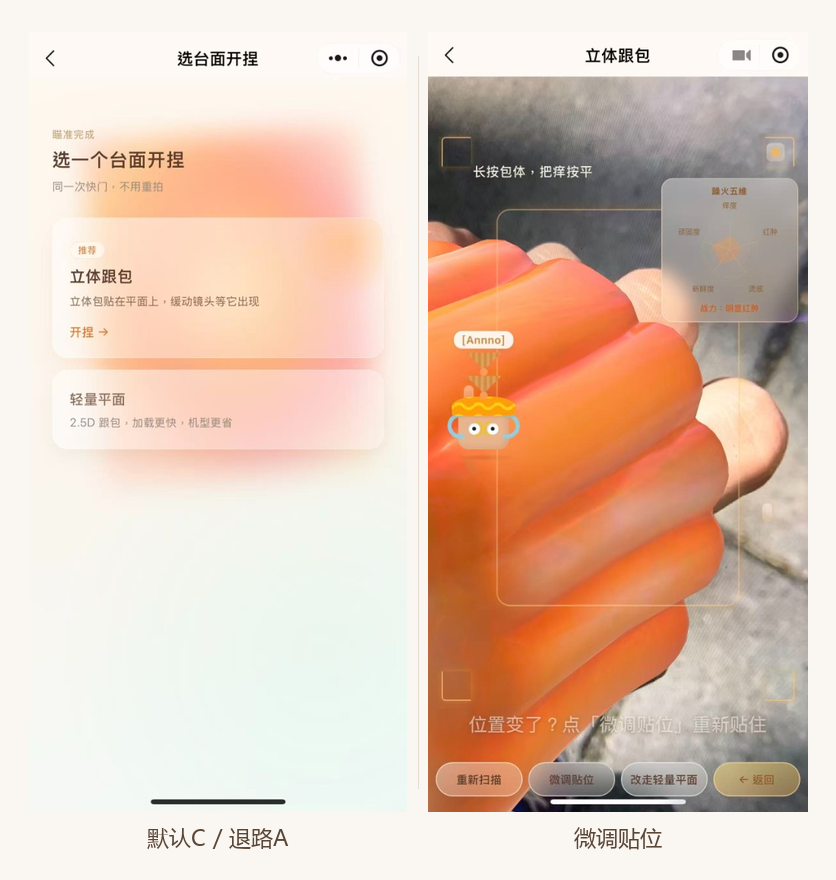](assets/storyboard-decision-fallback.png)

</details>

<details>
<summary><strong>轻量平面 A</strong></summary>

[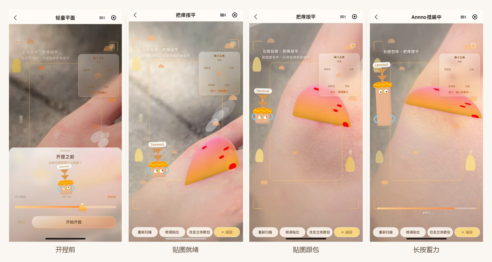](assets/storyboard-track-a.png)

</details>

<details>
<summary><strong>封印、月历与封印章</strong></summary>

[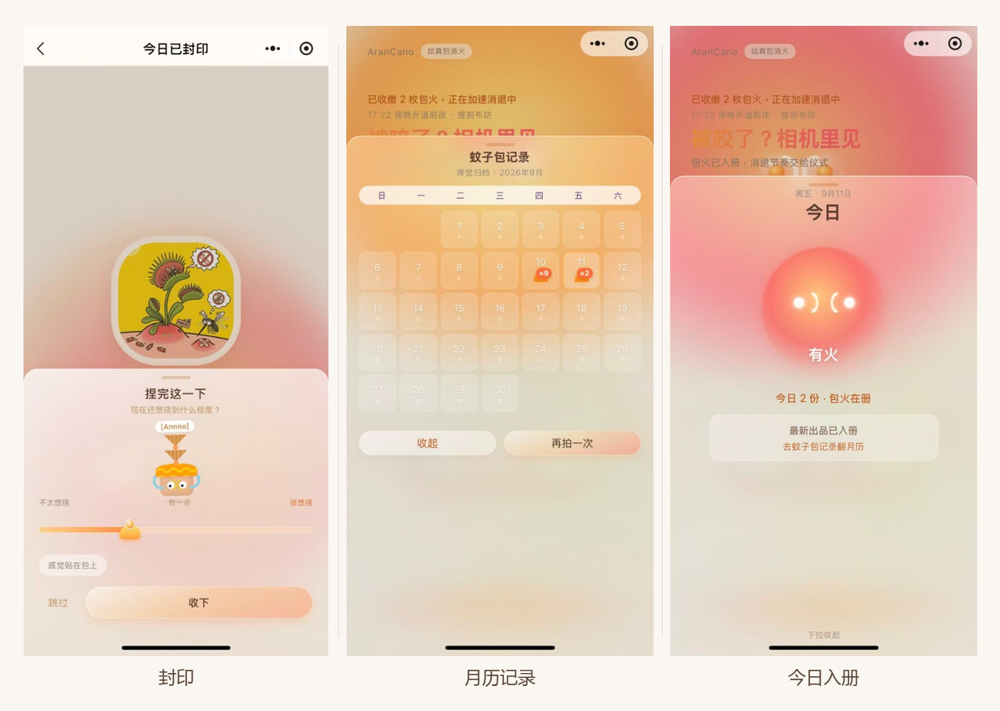](assets/storyboard-seal-record.png)

[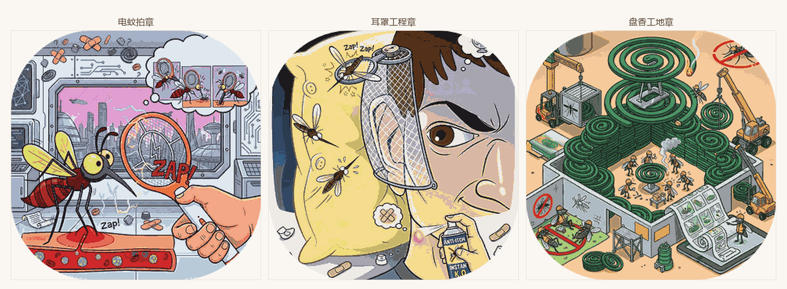](assets/storyboard-seal-stamps.png)

有包时的批语示例（本地文案，封印瞬间不调网络）：

- 「今日出品章已盖好，抓挠冲动请排队。」  
- 「封印成功。痒意还在，但仪式感已满格。」  
- 「你成功把『想抓』换成『想捏』，大脑点赞。」  

几天没被咬时（清静日）：

- 「皮肤清静日：蚊子没来打卡。」  
- 「一周公休：这周没给蚊子加班。」  
- 「蒸笼空空，炉子可以停炉晒屉了。」  

日历 / 周报的扩展口已标出（可接 AI API）；封印当刻仍用本地文案，主路径可离线演示。

</details>

<details>
<summary><strong>入场</strong> · 开屏 → 认识 Annno → 去开捏</summary>

开屏只亮品牌；对准发生在扫描页。

[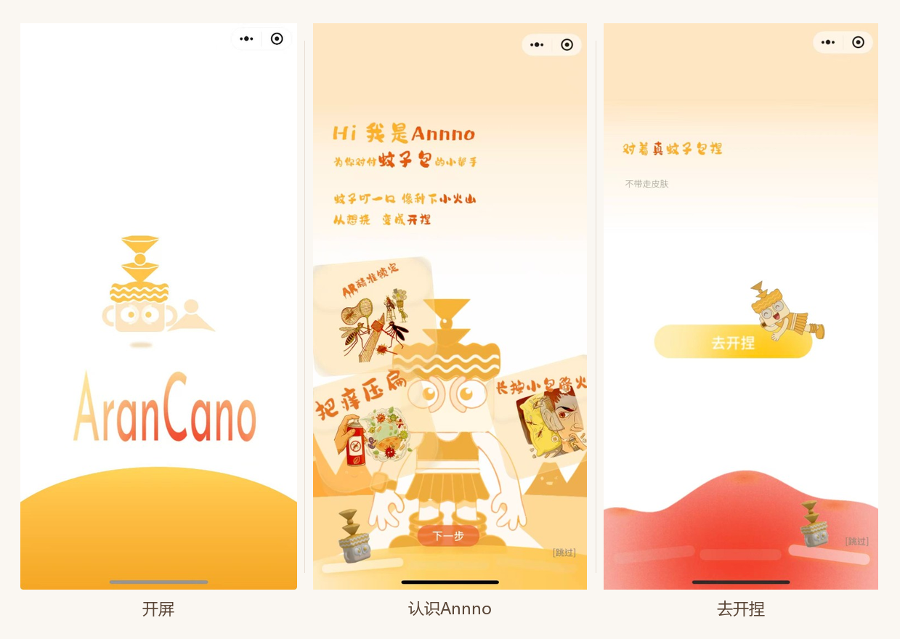](assets/storyboard-brand-entry.png)

</details>

更多文件说明见 [展示素材说明](assets/README.md) · [公开说明](NOTICE.md)。

### 这个项目能看见什么

- 短闭环游戏化（完成即离开）  
- 摄像头场景下的空间交互取舍  
- 视听触三条反馈一起跟进度  
- 真机观察与验证闭环（当场指标 + 日记法另轨）  
- 原生微信小程序落地与本地优先隐私  
- 文案 / 识别的扩展口已标出，主路径仍可离线演示  

---

## 7. 隐私与状态

### 隐私与公开

- 不公开可识别人脸、姓名、账号、家庭环境与未授权材料  
- 故事板皮肤：本人或书面许可；只说明交互  
- 用户原话用匿名改写；不贴原始聊天图  
- 不提交密钥与本地配置；不公开算法阈值与完整调参表  
- 第三方字体、音频、模型、品牌须先确认授权  

### 状态

独立交互设计与产品原型 · 真机验证中（可演示）。  
对外角色侧重：**产品原型 / 交互 / XR**；Annno 为服务主路径的陪伴型 IP，不单独作为「纯角色设定集」展示。

### 权利

保留所有权利。未经书面许可，不得复制、再分发、用于模型训练或商业使用本仓交互方案、Annno、视觉与文档。第三方资产权利归各自权利人。
